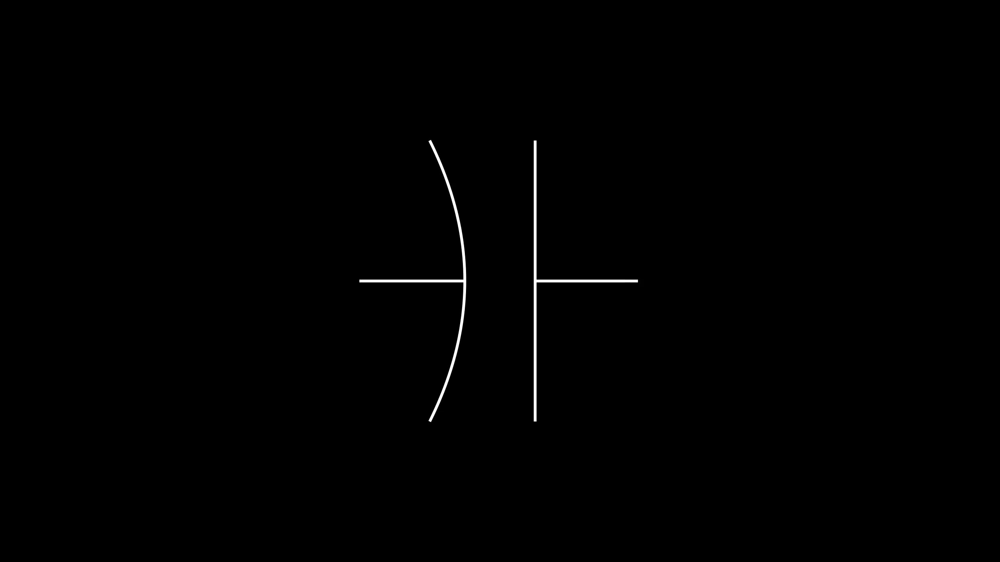
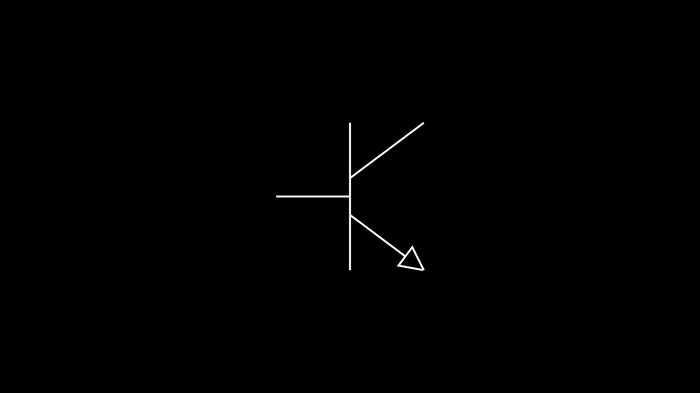
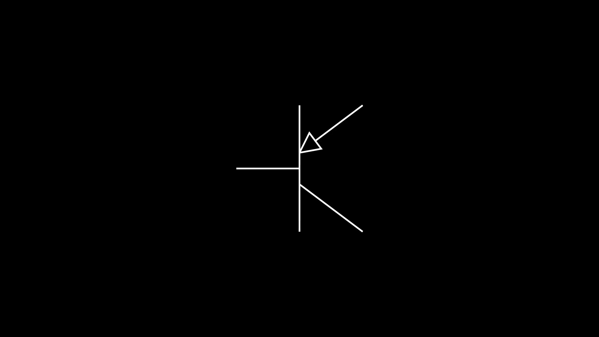
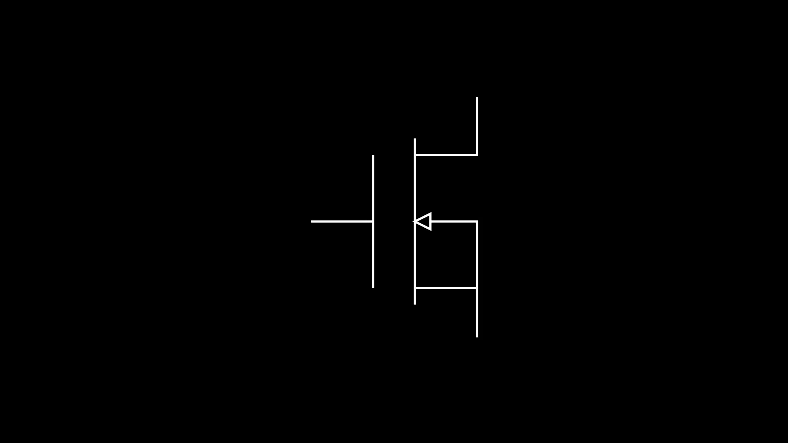

## Introduction

Welcome to circuitanim, an extension to 3b1b's manim python library. Much like manim simplifies animating mathematical obects, circuitanim simplifies animating circuits. As seen below, with only a few lines of code, you can render a complete circuit scene.

<!-- blank line -->
<figure class="video_container">
  <video controls="true" allowfullscreen="true" poster="graphics/videos/DrawCircuit_poster.jpg">
    <source src="graphics/videos/DrawCircuit.mp4" type="video/mp4">
    <!--<source src="path/to/video.ogg" type="video/ogg">
    <source src="path/to/video.webm" type="video/webm"> -->
  </video> 
</figure>
<!-- blank line -->

<link rel="stylesheet" href="graphics/prettify.css" />

<pre class ="prettyprint lang-py">
from manimlib.imports import *
from circuitanimlib.circuit import *
class DrawCircuit(Scene):
  def construct(self):
    res = Resistor()
    cap = Capacitor()
    batt = Battery()

    batt.rotate(PI/2)
    cap.rotate(-PI/2)
    cap.shift(RIGHT*3)
    res.shift(2*LEFT + UP*3)
    batt.shift(3*LEFT)

    circ = Circuit()
    circ.connect(batt.get_right(),res.get_left())
    circ.connect(res.get_right(),cap.get_left(),pin_top=True)
    circ.connect_right_to_left(cap.get_right(),batt.get_left())
    circ.render()
    
    self.play(ShowCreation(batt),ShowCreation(res),ShowCreation(cap),ShowCreation(circ),run_time=3)
</pre>

## Set Up

For up-to-date installation, see the Github readme which can be found [here](https://github.com/weras2/circuitanim).  

## Driver Classes

### Circuit
<pre class ="prettyprint lang-py">
class Circuit(VMobject)
</pre>
The circuit class is what glues together all of the electrical components in a scene. 

#### Methods
- <code class = "prettyprint lang-py">connect(point1,point2,pin_top=False)</code> Method for connecting electrical components, preferably from left to right. The function takes in two terminal coordinates to connect. The terminal coordinates can be found using methods specific to the electrical component. The optional parameter <code class = "prettyprint lang-py">pin_top=False</code> just specifies whether the anchor point of the 90 degree bend should lie in the horizontal axis of the first point (<code class = "prettyprint lang-py">False</code>) or second point(<code class = "prettyprint lang-py">True</code>).  
- <code class = "prettyprint lang-py">connect_right_to_left(point1,point2)</code> Method for connecting electrical components, specifically designed for when the first terminal (point) lies to the right of the second terminal.  
- <code class = "prettyprint lang-py">render()</code> Adds all points onto the Mobject for rendering.

### CircuitComponent 
<pre class ="prettyprint lang-py">class CircuitComponent(VMobject)</pre>
The CircuitComponent class is the parent class of all circuit components, except for logic gates. 

#### Methods 

- <code class = "prettyprint lang-py">get_left()</code> Method for getting coordinate of the leftmost terminal (point). Returns a 3D numpy array. 
- <code class = "prettyprint lang-py">get_right()</code> Method for getting coordinate of rightmost terminal (point). Returns a 3D numpy array. 

### LogicGate
<pre class ="prettyprint lang-py">class LogicGate(VMobject)</pre>
The LogicGate class is the parent class of the 8 available logic gates. 

#### Methods
- <code class = "prettyprint lang-py">get_inputA()</code> Method for getting coordinate of the first input terminal (point). Returns a 3D numpy array. 
- <code class = "prettyprint lang-py">get_inputB()</code> Method for getting coordinate of the second input terminal (point). Returns a 3D numpy array. 
- <code class = "prettyprint lang-py">get_output()</code> Method for getting coordinate of the output terminal (point). Returns a 3D numpy array. 

## Basic Electrical Components 

### Capacitor

By default, a non-polar capacitor is rendered. If you wish to render a polar capacitor, you can pass the optional parameter <code class = "prettyprint lang-py">is_polar</code> and set qit equal to <code class = "prettyprint lang-py">True</code>   

        

    

        
    

    

        
   
          <pre class ="prettyprint lang-py">
from manimlib.imports import *
from circuitanimlib.circuit import *
class Sample(Scene):
  def construct(self):
    obj = Capacitor()
    self.play(ShowCreation(obj))
          </pre>          
        

    

        

    

        
    

    

        
   
          <pre class ="prettyprint lang-py">
from manimlib.imports import *
from circuitanimlib.circuit import *
class Sample(Scene):
  def construct(self):
    obj = Capacitor(is_polar=True)
    self.play(ShowCreation(obj))
          </pre>          
        

    

### Diode 

By default, a standard diode is rendered. If you wish to change the diode type, in the constructor you can pass the optional parameter <code class ="prettyprint lang-py">diode_type</code> and specify one of the supported enums: <code class ="prettyprint lang-py">DIODE_DEFAULT</code>, <code class ="prettyprint lang-py">DIODE_ZENER</code>, <code class ="prettyprint lang-py">DIODE_SCHOTTKY</code>. 

        

    

        <video controls="true" allowfullscreen="true" poster="graphics/basic/diode_default.jpg"><source src="graphics/videos/diode_default.mp4" type="video/mp4"></video> 
    

    

        
   
          <pre class ="prettyprint lang-py">
from manimlib.imports import *
from circuitanimlib.circuit import *
class Sample(Scene):
  def construct(self):
    obj = Diode()
    self.play(ShowCreation(obj))
          </pre>          
        

    

        

    

        <video controls="true" allowfullscreen="true" poster="graphics/basic/diode_zener.jpg"><source src="graphics/videos/diode_zener.mp4" type="video/mp4"></video>
    

    

        
   
          <pre class ="prettyprint lang-py">
from manimlib.imports import *
from circuitanimlib.circuit import *
class Sample(Scene):
  def construct(self):
    obj = Diode(diode_type=DIODE_ZENER)
    self.play(ShowCreation(obj))
          </pre>          
        

    

        

    

        <video controls="true" allowfullscreen="true" poster="graphics/basic/diode_schottky.jpg"><source src="graphics/videos/diode_schottky.mp4" type="video/mp4"></video>
    

    

        
   
          <pre class ="prettyprint lang-py">
from manimlib.imports import *
from circuitanimlib.circuit import *
class Sample(Scene):
  def construct(self):
    obj = Diode(diode_type=DIODE_SCHOTTKY)
    self.play(ShowCreation(obj))
          </pre>          
        

    

### Inductor 

        

    

        
    

    

        
   
          <pre class ="prettyprint lang-py">
from manimlib.imports import *
from circuitanimlib.circuit import *
class Sample(Scene):
  def construct(self):
    obj = Inductor()
    self.play(ShowCreation(obj))
          </pre>          
        

    

### Resistor

        

    

        
    

    

        
   
          <pre class ="prettyprint lang-py">
from manimlib.imports import *
from circuitanimlib.circuit import *
class Sample(Scene):
  def construct(self):
    obj = Resistor()
    self.play(ShowCreation(obj))
          </pre>          
        

    

## Logic Gates

### AND & NAND

<link rel="stylesheet" type = "text/css" href="mod.css">

        

    

        <video controls="true" allowfullscreen="true" poster="graphics/logic/and.jpg"><source src="graphics/videos/and.mp4" type="video/mp4"></video> 
    

    

        
   
          <pre class ="prettyprint lang-py">
from manimlib.imports import *
from circuitanimlib.logic import *
class Sample(Scene):
  def construct(self):
    obj = AND()
    self.play(ShowCreation(obj))
          </pre>          
        

    

        

    

        <video controls="true" allowfullscreen="true" poster="graphics/logic/nand.jpg"><source src="graphics/videos/nand.mp4" type="video/mp4"></video> 
    

    

        
   
          <pre class ="prettyprint lang-py">
from manimlib.imports import *
from circuitanimlib.logic import *
class Sample(Scene):
  def construct(self):
    obj = NAND()
    self.play(ShowCreation(obj))
          </pre>          
        

    

### OR & NOR

        

    

        <video controls="true" allowfullscreen="true" poster="graphics/logic/or.jpg"><source src="graphics/videos/or.mp4" type="video/mp4"></video> 
    

    

        
   
          <pre class ="prettyprint lang-py">
from manimlib.imports import *
from circuitanimlib.logic import *
class Sample(Scene):
  def construct(self):
    obj = OR()
    self.play(ShowCreation(obj))
          </pre>          
        

    

        

    

        <video controls="true" allowfullscreen="true" poster="graphics/logic/nor.jpg"><source src="graphics/videos/nor.mp4" type="video/mp4"></video> 
    

    

        
   
          <pre class ="prettyprint lang-py">
from manimlib.imports import *
from circuitanimlib.logic import *
class Sample(Scene):
  def construct(self):
    obj = NOR()
    self.play(ShowCreation(obj))
          </pre>          
        

    

### XOR & XNOR

        

    

        <video controls="true" allowfullscreen="true" poster="graphics/logic/xor.jpg"><source src="graphics/videos/xor.mp4" type="video/mp4"></video> 
    

    

        
   
          <pre class ="prettyprint lang-py">
from manimlib.imports import *
from circuitanimlib.logic import *
class Sample(Scene):
  def construct(self):
    obj = XOR()
    self.play(ShowCreation(obj))
          </pre>          
        

    

        

    

        <video controls="true" allowfullscreen="true" poster="graphics/logic/xnor.jpg"><source src="graphics/videos/xnor.mp4" type="video/mp4"></video> 
    

    

        
   
          <pre class ="prettyprint lang-py">
from manimlib.imports import *
from circuitanimlib.logic import *
class Sample(Scene):
  def construct(self):
    obj = XNOR()
    self.play(ShowCreation(obj))
          </pre>          
        

    

### Buffer & NOT

        

    

        <video controls="true" allowfullscreen="true" poster="graphics/logic/buffer.jpg"><source src="graphics/videos/buffer.mp4" type="video/mp4"></video> 
    

    

        
   
          <pre class ="prettyprint lang-py">
from manimlib.imports import *
from circuitanimlib.logic import *
class Sample(Scene):
  def construct(self):
    obj = Buffer()
    self.play(ShowCreation(obj))
          </pre>          
        

    

        

    

        <video controls="true" allowfullscreen="true" poster="graphics/logic/not.jpg"><source src="graphics/videos/not.mp4" type="video/mp4"></video> 
    

    

        
   
          <pre class ="prettyprint lang-py">
from manimlib.imports import *
from circuitanimlib.logic import *
class Sample(Scene):
  def construct(self):
    obj = NOT()
    self.play(ShowCreation(obj))
          </pre>          
        

    

## Power Sources 

### AC Source

        

    

          <video controls="true" allowfullscreen="true" poster="graphics/power_sources/ac_source.jpg"><source src="graphics/videos/ac_source.mp4" type="video/mp4"></video> 
    

    

        
   
          <pre class ="prettyprint lang-py">
from manimlib.imports import *
from circuitanimlib.circuit import *
class Sample(Scene):
  def construct(self):
    obj = ACSource()
    self.play(ShowCreation(obj))
          </pre>          
        

    

### Battery 

        

    

        
    

    

        
   
          <pre class ="prettyprint lang-py">
from manimlib.imports import *
from circuitanimlib.circuit import *
class Sample(Scene):
  def construct(self):
    obj = Battery()
    self.play(ShowCreation(obj))
          </pre>          
        

    

### Current Source

        

    

        <video controls="true" allowfullscreen="true" poster="graphics/power_sources/current_source_independent.jpg"><source src="graphics/videos/current_source_independent.mp4" type="video/mp4"></video> 
    

    

        
   
          <pre class ="prettyprint lang-py">
from manimlib.imports import *
from circuitanimlib.circuit import *
class Sample(Scene):
  def construct(self):
    obj = CurrentSource()
    self.play(ShowCreation(obj))
          </pre>          
        

    

        

    

        <video controls="true" allowfullscreen="true" poster="graphics/power_sources/current_source_dependent.jpg"><source src="graphics/videos/current_source_dependent.mp4" type="video/mp4"></video> 
    

    

        
   
          <pre class ="prettyprint lang-py">
from manimlib.imports import *
from circuitanimlib.circuit import *
class Sample(Scene):
  def construct(self):
    obj = CurrentSource(is_dependent=True)
    self.play(ShowCreation(obj))
          </pre>          
        

    

### Voltage Source

        

    

        <video controls="true" allowfullscreen="true" poster="graphics/power_sources/voltage_source_independent.jpg"><source src="graphics/videos/voltage_source_independent.mp4" type="video/mp4"></video> 
    

    

        
   
          <pre class ="prettyprint lang-py">
from manimlib.imports import *
from circuitanimlib.circuit import *
class Sample(Scene):
  def construct(self):
    obj = VoltageSource()
    self.play(ShowCreation(obj))
          </pre>          
        

    

        

    

        <video controls="true" allowfullscreen="true" poster="graphics/power_sources/voltage_source_dependent.jpg"><source src="graphics/videos/voltage_source_dependent.mp4" type="video/mp4"></video> 
    

    

        
   
          <pre class ="prettyprint lang-py">
from manimlib.imports import *
from circuitanimlib.circuit import *
class Sample(Scene):
  def construct(self):
    obj = VoltageSource(is_dependent=True)
    self.play(ShowCreation(obj))
          </pre>          
        

    

## Transistors 


### BJTs 

By default, the bjt is rendered as npn. If you would like to render a pnp bjt, then in the constructor just pass in the optional parameter <code class = "prettyprint lang-py">is_pnp</code> and set it to <code class = "prettyprint lang-py">False</code> like so <code class = "prettyprint lang-py">Bjt(is_pnp=False)</code>. 

        

    

        
    

    

        
   
          <pre class ="prettyprint lang-py">
from manimlib.imports import *
from circuitanimlib.circuit import *
class Sample(Scene):
  def construct(self):
    obj = Bjt()
    self.play(ShowCreation(obj))
          </pre>          
        

    

        

    

        
    

    

        
   
          <pre class ="prettyprint lang-py">
from manimlib.imports import *
from circuitanimlib.circuit import *
class Sample(Scene):
  def construct(self):
    obj = Bjt(is_pnp=False)
    self.play(ShowCreation(obj))
          </pre>          
        

    

#### Methods
- <code class = "prettyprint lang-py">get_base()</code> Returns coordinates of the base terminal  
- <code class = "prettyprint lang-py">get_collector()</code> Returns coordinates of the collector terminal  
- <code class = "prettyprint lang-py">get_emitter()</code> Returns coordinates of the emitter terminal  

### Mosfets

By default, the mosfet is rendered as nmos. If you would like to render it as pmos,  then in the constructor just pass in the optional parameter <code class = "prettyprint lang-py">is_nmos</code> and set it to <code class = "prettyprint lang-py">False</code> like so <code class = "prettyprint lang-py">Mosfet(is_nmos=False)</code>.

        

    

        
    

    

        
   
          <pre class ="prettyprint lang-py">
from manimlib.imports import *
from circuitanimlib.circuit import *
class Sample(Scene):
  def construct(self):
    obj = Mosfet()
    self.play(ShowCreation(obj))
          </pre>          
        

    

        

    

        
    

    

        
   
          <pre class ="prettyprint lang-py">
from manimlib.imports import *
from circuitanimlib.circuit import *
class Sample(Scene):
  def construct(self):
    obj = Mosfet(is_nmos=False)
    self.play(ShowCreation(obj))
          </pre>          
        

    

#### Methods
- <code class = "prettyprint lang-py">get_drain()</code> Returns coordinates of the drain terminal  
- <code class = "prettyprint lang-py">get_gate()</code> Returns coordinates of the gate terminal  
- <code class = "prettyprint lang-py">get_source()</code> Returns coordinates of the source terminal  

